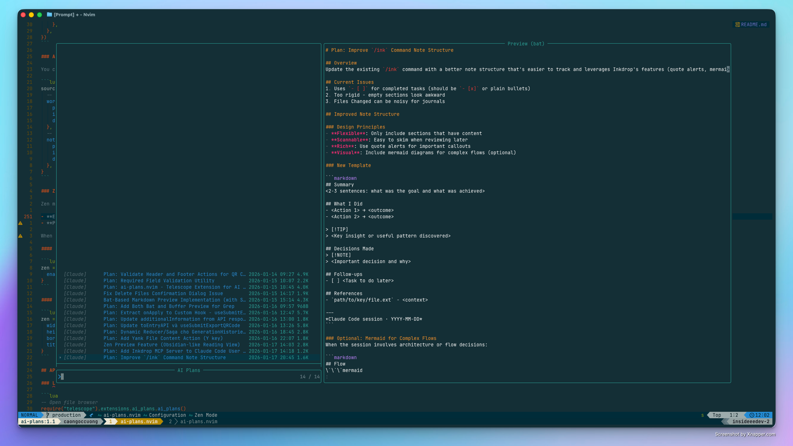
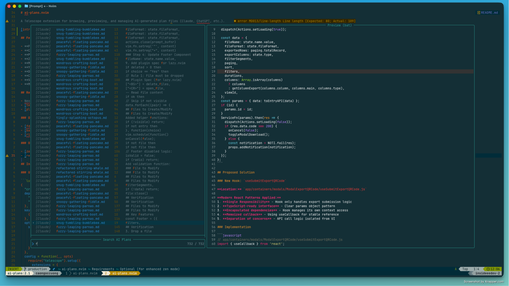

# ai-plans.nvim

A Telescope extension for browsing, previewing, and managing AI-generated plan files (Claude, ChatGPT, etc.).



## Features

- **Fuzzy search** through all AI plan markdown files
- **Content search** - search inside plan files with ripgrep
- **Preview pane** with syntax highlighting
- **Zen mode** - distraction-free floating window for reading/editing plans
- **Multi-select** files with Tab
- **Yank paths** or **yank content** to clipboard
- **Delete files** with confirmation
- **Configurable sources** - add Claude, ChatGPT, Gemini, or any custom paths
- **Smart sorting** by modification time, name, or size
- **Markdown title extraction** - shows plan titles instead of filenames

## Requirements

- Neovim >= 0.9.0
- [telescope.nvim](https://github.com/nvim-telescope/telescope.nvim)
- [plenary.nvim](https://github.com/nvim-lua/plenary.nvim)

### Optional (for better performance)

- [fd](https://github.com/sharkdp/fd) - faster file discovery
- [bat](https://github.com/sharkdp/bat) - better preview highlighting
- [ripgrep](https://github.com/BurntSushi/ripgrep) - faster content search

### Optional (for enhanced zen mode)

- [zen-mode.nvim](https://github.com/folke/zen-mode.nvim) - distraction-free environment
- [render-markdown.nvim](https://github.com/MeanderingProgrammer/render-markdown.nvim) - Obsidian-like markdown rendering in preview mode

## Installation

### Using [lazy.nvim](https://github.com/folke/lazy.nvim)

```lua
{
  "crafts69guy/ai-plans.nvim",
  dependencies = {
    "nvim-telescope/telescope.nvim",
    "nvim-lua/plenary.nvim",
  },
  keys = {
    { "<C-A-p>", "<cmd>Telescope ai_plans<cr>", desc = "AI Plans" },
  },
  opts = {
    sources = {
      claude = {
        path = "~/.claude/plans/",
        icon = "",
      },
    },
  },
  config = function(_, opts)
    require("telescope").setup({
      extensions = {
        ai_plans = opts,
      },
    })
    require("telescope").load_extension("ai_plans")
  end,
}
```

### Using [packer.nvim](https://github.com/wbthomason/packer.nvim)

```lua
use {
  "crafts69guy/ai-plans.nvim",
  requires = {
    "nvim-telescope/telescope.nvim",
    "nvim-lua/plenary.nvim",
  },
  config = function()
    require("telescope").setup({
      extensions = {
        ai_plans = {
          sources = {
            claude = { path = "~/.claude/plans/", icon = "" },
          },
        },
      },
    })
    require("telescope").load_extension("ai_plans")
  end,
}
```

## Usage

### Commands

```vim
:Telescope ai_plans      " Open the file browser
:AiPlans                 " Alternative command
:AiPlans claude          " Filter by source (if multiple configured)

:Telescope ai_plans grep " Search content in plan files
:AiPlansGrep             " Alternative command
:AiPlansGrep pattern     " Search with initial pattern
```

### Default Keybindings

#### In Normal Mode (inside picker)

| Key            | Action                                        |
| -------------- | --------------------------------------------- |
| `<Tab>`        | Toggle selection and move to next             |
| `<S-Tab>`      | Toggle selection and move to previous         |
| `y`            | Yank selected file path(s) to clipboard       |
| `Y`            | Yank file content to clipboard (single file)  |
| `<BS>` or `d`  | Delete selected file(s) with confirmation     |
| `<CR>`         | Smart open (zen mode if enabled, else normal) |
| `e`            | Open file in current window (bypass zen)      |
| `z`            | Open file in zen mode (editable)              |
| `Z`            | Preview file in zen mode (read-only)          |
| `o`            | Open file in horizontal split                 |
| `v`            | Open file in vertical split                   |
| `t`            | Open file in new tab                          |
| `<C-d>`        | Scroll preview down                           |
| `<C-u>`        | Scroll preview up                             |
| `r`            | Refresh the file list                         |
| `q` or `<Esc>` | Close picker                                  |

#### In Insert Mode (inside picker)

| Key       | Action                                        |
| --------- | --------------------------------------------- |
| `<Tab>`   | Toggle selection and move to next             |
| `<S-Tab>` | Toggle selection and move to previous         |
| `<C-d>`   | Scroll preview down                           |
| `<C-u>`   | Scroll preview up                             |
| `<CR>`    | Smart open (zen mode if enabled, else normal) |



## Configuration

### Full Configuration Example

```lua
require("telescope").setup({
  extensions = {
    ai_plans = {
      -- AI source paths
      sources = {
        claude = {
          path = "~/.claude/plans/",
          pattern = "*.md",
          display_name = "Claude",
          icon = "",
        },
        chatgpt = {
          path = "~/Documents/ChatGPT/",
          pattern = "*.md",
          display_name = "ChatGPT",
          icon = "",
        },
        gemini = {
          path = "~/Documents/Gemini/",
          pattern = "*.md",
          display_name = "Gemini",
          icon = "",
        },
      },

      -- External tools (auto-detected)
      use_fd = true,   -- Use fd for faster file discovery
      use_bat = true,  -- Use bat for preview if available
      use_rg = true,   -- Use ripgrep for content search

      -- UI settings
      theme = "dropdown",  -- "dropdown", "ivy", "cursor", or nil
      initial_mode = "normal",
      layout_strategy = "horizontal",
      layout_config = {
        preview_width = 0.6,
        width = 0.9,
        height = 0.8,
      },

      -- Sorting
      sort_by = "mtime",  -- "mtime" (newest first), "name", "size"

      -- Display
      show_title = true,  -- Extract and show markdown titles

      -- Zen mode settings
      zen = {
        enabled = true,           -- Use zen mode by default when opening files
        width_ratio = 0.8,        -- Popup width (80% of editor width)
        height_ratio = 0.8,       -- Popup height (80% of editor height)
        border = "rounded",       -- Border style: "rounded", "single", "double", etc.
        title = true,             -- Show filename in window title
        title_pos = "center",     -- Title position: "left", "center", "right"
        close_on_escape = true,   -- Close zen window with <Esc> in normal mode
        close_on_q = true,        -- Close zen window with q in normal mode
        prompt_save = true,       -- Prompt to save changes before closing
        use_zen_mode = true,      -- Integrate with zen-mode.nvim if available
        wo = {                    -- Window options for better reading
          wrap = true,
          linebreak = true,
          number = false,
          relativenumber = false,
          signcolumn = "no",
          cursorline = false,
          foldcolumn = "0",
        },
      },

      -- Custom mappings (optional - extends defaults)
      mappings = {
        n = {
          ["<C-x>"] = function(prompt_bufnr)
            -- Custom action
          end,
        },
      },
    },
  },
})
```

### Adding Custom Sources

You can add any directory as a source:

```lua
sources = {
  -- Work projects
  work_plans = {
    path = "~/Work/plans/",
    icon = "",
    display_name = "Work",
  },
  -- Personal notes
  notes = {
    path = "~/Notes/ai-conversations/",
    icon = "",
    display_name = "Notes",
  },
}
```

### Zen Mode

Zen mode opens files in a distraction-free floating window. There are two modes:

- **Edit mode** (`z` key) - Full editing with all your keybindings
- **Preview mode** (`Z` key) - Read-only with rendered markdown (if render-markdown.nvim is installed)

When `zen.enabled = true`, pressing `<CR>` uses zen mode by default. Use `e` to bypass zen and open normally.

#### Disabling Zen Mode

```lua
zen = {
  enabled = false,  -- <CR> opens files normally
}
```

#### Customizing Zen Window

```lua
zen = {
  width_ratio = 0.7,     -- Narrower window
  height_ratio = 0.9,    -- Taller window
  border = "double",     -- Different border style
  title_pos = "left",    -- Title on the left
}
```

## API

### Lua API

```lua
-- Open file browser
require("telescope").extensions.ai_plans.ai_plans()

-- Open with custom options
require("telescope").extensions.ai_plans.ai_plans({
  sort_by = "name",
  theme = "ivy",
})

-- Open content search (grep)
require("telescope").extensions.ai_plans.grep()

-- Grep with initial search pattern
require("telescope").extensions.ai_plans.grep({
  default_text = "implementation",
})

-- Open with zen mode disabled for this instance
require("telescope").extensions.ai_plans.ai_plans({
  zen = { enabled = false },
})

-- Access actions programmatically
local actions = require("telescope").extensions.ai_plans.actions

-- Access zen module for programmatic use
local zen = require("telescope").extensions.ai_plans.zen
zen.open("~/path/to/file.md")           -- Open in edit mode
zen.open("~/path/to/file.md", true)     -- Open in preview mode
```

### Available Actions

```lua
local actions = require("telescope._extensions.ai_plans.actions")

-- File browser actions
actions.yank_paths(prompt_bufnr)           -- Yank paths to clipboard
actions.yank_content(prompt_bufnr)         -- Yank file content to clipboard
actions.delete_files(prompt_bufnr)         -- Delete with confirmation
actions.toggle_selection_and_next(prompt_bufnr)
actions.toggle_selection_and_prev(prompt_bufnr)
actions.smart_open(prompt_bufnr)           -- Smart open (respects zen setting)
actions.open_file(prompt_bufnr)            -- Open in current window
actions.open_in_split(prompt_bufnr)        -- Open in horizontal split
actions.open_in_vsplit(prompt_bufnr)       -- Open in vertical split
actions.open_in_tab(prompt_bufnr)          -- Open in new tab
actions.refresh(prompt_bufnr)              -- Refresh file list

-- Zen mode actions
actions.open_in_zen(prompt_bufnr)          -- Open in zen (editable)
actions.preview_in_zen(prompt_bufnr)       -- Preview in zen (read-only)

-- Grep picker actions (open at matched line)
actions.open_file_at_line(prompt_bufnr)    -- Open at matched line
actions.open_at_line_split(prompt_bufnr)   -- Open in split at line
actions.open_at_line_vsplit(prompt_bufnr)  -- Open in vsplit at line
```

## Integration with sidekick.nvim

If you use [sidekick.nvim](https://github.com/folke/sidekick.nvim), add a keybinding in the `<leader>a` group:

```lua
keys = {
  { "<leader>aP", "<cmd>Telescope ai_plans<cr>", desc = "Browse AI Plans" },
  { "<leader>aG", "<cmd>Telescope ai_plans grep<cr>", desc = "Search AI Plans" },
}
```

## Troubleshooting

### Plans not showing up

1. Check the source path exists: `:lua print(vim.fn.isdirectory(vim.fn.expand("~/.claude/plans/")))`
2. Verify there are `.md` files in the directory
3. Try with `warn_missing = true` in opts to see warnings

### Extension not loading

1. Ensure telescope.nvim is installed and working
2. Check `:Telescope` shows available pickers
3. Run `:lua require("telescope").load_extension("ai_plans")`

### Performance issues

- Install `fd` for faster file discovery
- Set `show_title = false` to skip markdown parsing

## License

[MIT](https://opensource.org/licenses/MIT)

## Contributing

Contributions are welcome! Please feel free to submit a Pull Request.
